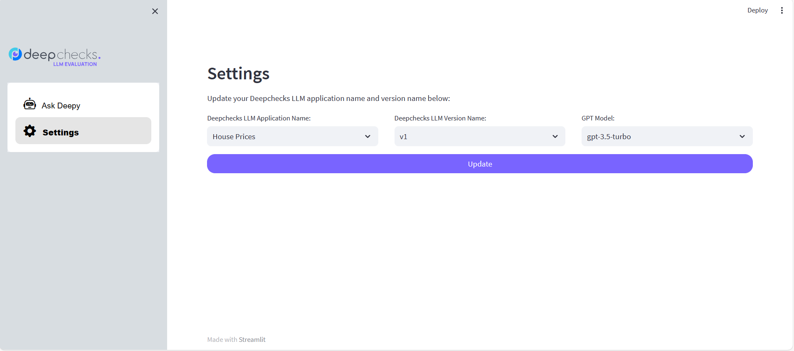

# CSV Question Answering


🤖 Integrate your Agent-based LLM application with Deepchecks LLM Evaluation using Deepchecks LLM SDK 🤖

- [App description](#app-description)
- [Environment Setup](#environment-setup)
- [How to use Deepchecks LLM SDK?](#how-to-use-deepchecks-llm-sdk)
  - [Instantiate Deepchecks LLM SDK client](#instantiate-deepchecks-llm-sdk-client)
  - [Process the user queries in real time](#process-the-user-queries-in-real-time)
  - [Annotate the LLM response](#annotate-the-llm-response)
- [Deploy the app to Streamlit](#deploy-the-app-to-streamlit)

# App description
This application utilizes the dataframe agent by Langchain in order to answer questions from a pandas DataFrame. For this application, you can upload any CSV or Excel file and then ask questions about it. We can configure the GPT model utilized to either use GPT-3.5-turbo or GPT-4. To access the information retrieval, the python code snippet to fetch data from the dataframe, and intermediate steps of the agent etc., we log all these things in a text file and then extract the required information. You can test the app at [Deepy Bot](https://question-answer-over-csv-deepchecks.streamlit.app/)

> **User Input:** How many rows are there?<br>
  **LLM Response:** There are 1460 rows in the dataframe.

> **User Input:** What is the price of the property having largest number of pools??<br>
  **LLM Response:** The price of the property with the largest number of pools is $274,970.


## Environment Setup

The application works on Windows, Linux, and Mac. In order to set up your environment, you can create a virtual environment and install all requirements:

```shell
python -m venv venv
source venv/bin/activate
pip install -r requirements.txt
```

Then rename the `.env.example` file to `.env` and update the following keys as follows:

```python
# Get the OpenAI API key
OPENAI_API_KEY='<OPENAI_API_KEY>'
# Login to deepchecks' service and generate new API Key (Configuration -> API Key) and place it here
DEEPCHECKS_LLM_API_KEY='<DEEPCHECKS_LLM_API_KEY>'
# Fill deepchecks host name here
DEEPCHECKS_LLM_HOST_URL='<DEEPCHECKS_LLM_HOST_URL>'
```

Now, you are ready to start the streamlit app locally by running the following command:
```python
streamlit run main.py
```

After running the application, if your Deepchecks LLM application name and version name does not match with the names on the Deepchecks LLM app, you need to update the Deepchecks LLM application name and version name from the UI by going to the **Settings** section as shown in the below image:



You can also update the GPT model from the **Settings** section. By default, the GPT model is selected to *"gpt-3.5-turbo"*.

# How to use Deepchecks LLM SDK?
Before proceeding, make sure that you have an app created in the Deepchecks LLM evaluation application. We will not use the auto collect feature of the SDK here since there can be multiple LLM calls depending upon your agent pipeline. So we will be using the logging each interaction using the `log_interaction()` function provided by the SDK.

## Instantiate Deepchecks LLM SDK client

```python
from deepchecks_llm_client.client import dc_client

dc_client.init(host=DEEPCHECKS_LLM_HOST_URL,
               api_token=DEEPCHECKS_LLM_API_KEY,
               app_name=DEEPCHECKS_LLM_APP_NAME,
               version_name=DEEPCHECKS_LLM_APP_VERSION_NAME,
               env_type=EnvType.PROD,
               auto_collect=False  # Setting auto collect to False
               )
```

## Process the user queries in real time

```python

result = call_llm_with_chatopenai(st.session_state.dataset, user_input)

dc_client.log_interaction(user_input=result['user_input'],
                          model_response=result['response'],
                          full_prompt=result['llm_prompt'],
                          information_retrieval=str(result['information_retrieval']),
                          ext_interaction_id=user_generated_unique_key)

```

## Annotate the LLM response

```python
from deepchecks_llm_client.api import AnnotationType

# If you want to annotate the LLM response as 'Good'
dc_client.annotate(ext_interaction_id=user_generated_unique_key, annotation=AnnotationType.GOOD)

# If you want to annotate the LLM response as 'Bad'
dc_client.annotate(ext_interaction_id=user_generated_unique_key, annotation=AnnotationType.GOOD)
```

# Deploy the app to Streamlit
The code to run the StreamLit app is in `main.py`. Note that when setting up your StreamLit app you should make sure to add all the environment variables in your `.env` file as a secret environment variable as Secrets in Settings of your deployed Streamlit app.
